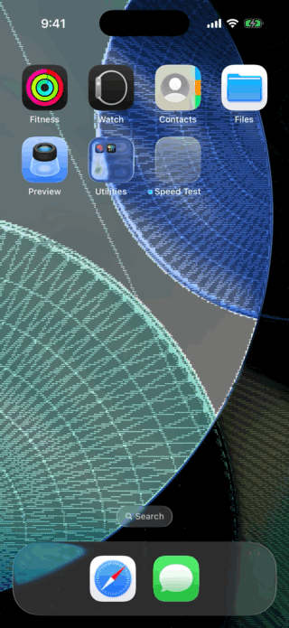
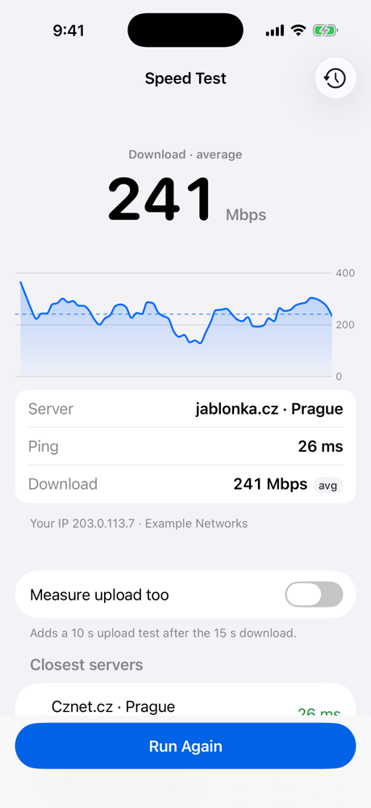
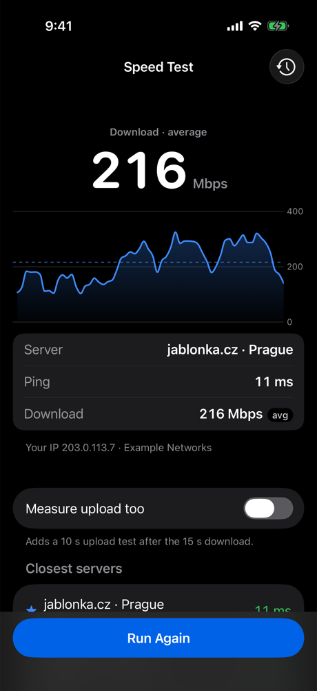
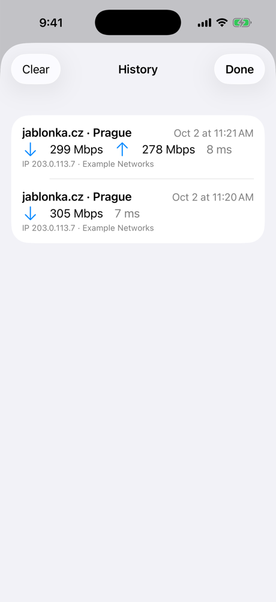
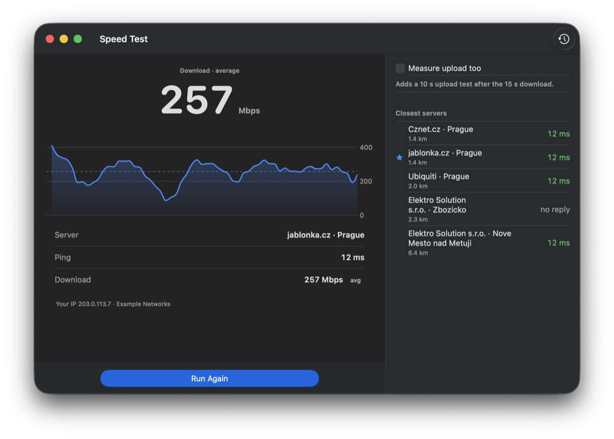
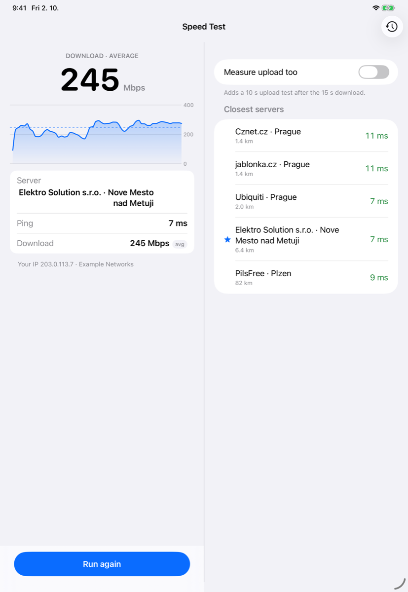

# Speed Test

A speed test for iPhone, iPad and Mac. It takes the five servers from Ubiquiti's public speed-test directory that are
closest to you, pings each of them with real ICMP, and measures the download speed on the one that answers fastest.

**In short**
- **The brief, in full:** one screen with Start/Stop and the three fields (server, ping, download), the current speed
  during the 15 s test and the average after it, ICMP rather than an HTTP "ping".
- **Three decisions that matter:** ICMP written for the app (iOS has no ping API); one server measured, as the brief
  asks (the web client blends several); a plain average from the first byte (the web client reports the faster half).
- **Beyond the brief, out of the way:** an optional upload, a history sheet, a line with your public IP, two panes on
  iPad and Mac, and Czech. The main screen works without any of them.

  

| Finished, light | Finished, dark | History |
|---|---|---|
|  |  |  |

| Mac | iPad |
|---|---|
|  |  |

## Where to look

| File | What's there |
|---|---|
| [`SpeedTest+Run.swift`](SpeedTestPackage/Sources/SpeedTestFeature/SpeedTest+Run.swift) | The run as reducer steps: locate, fetch, ping, choose, measure, fail over |
| [`Pinger.swift`](SpeedTestPackage/Sources/ICMP/Pinger.swift), [`PingSession.swift`](SpeedTestPackage/Sources/ICMP/PingSession.swift) | ICMP echo over unprivileged sockets, and the reply matching |
| [`ServerSelector.swift`](SpeedTestPackage/Sources/SpeedTestKit/ServerSelector.swift) | The five closest, and the ranking by ping |
| [`TransferMeterLive.swift`](SpeedTestPackage/Sources/SpeedTestKit/TransferMeter/TransferMeterLive.swift) | First byte against the stall timeout, then a sample every 250 ms |
| [`SpeedTestTransferTests.swift`](SpeedTestPackage/Tests/SpeedTestFeatureTests/SpeedTestTransferTests.swift) | What an exhaustive `TestStore` test of the run looks like |
| [`docs/DESIGN.md`](docs/DESIGN.md) | The full design: flow, measurement rules, concurrency, errors, testing |

## What it does

1. On the first Start it asks for your location, then fetches the list of speed-test servers.
2. It takes the five closest servers and pings each of them over ICMP, five times.
3. It picks the server with the lowest median ping.
4. It downloads from that server for 15 seconds over parallel connections. The Download field and a big number show
   the current speed, a graph draws it, and at the end the field shows the average. With "Measure upload too" on, a
   10 s upload follows the same way.

The app is in English and Czech.

### How I found the API

The API isn't documented. I watched wifiman.com's network traffic in the browser's developer tools, then confirmed
every request with `curl`:

| Request | What it's for |
|---|---|
| `GET https://sp-dir.uwn.com/api/v2/servers?secured=only&latitude=…&longitude=…` | The server list with coordinates. `secured=only` makes every server URL `https://`. |
| `POST https://sp-dir.uwn.com/api/v1/tokens` | A test token, `{"token": "…", "ttl": 80}`. It goes in the `x-test-token` header. |
| `GET https://sp-dir.uwn.com/api/v1/ip` | Your public IP address and provider, shown under the result card. |
| `GET <server>/download?size=<bytes>` and `POST <server>/upload` | The transfers themselves. |

The web client measures latency with HTTP requests and a WebSocket. The app replaces both with real ICMP echo, as
the task asks.

## Running it

- **Xcode 26.6 or newer;** iOS 17 or macOS 14. CI builds and tests with Xcode 26.6 and Xcode 27.0.
- Open `SpeedTest.xcodeproj`, pick your own team under Signing & Capabilities, and run the `SpeedTest` scheme on an
  iPhone, an iPad, a simulator or "My Mac".
- **ICMP works on a device, in the Simulator and in the sandboxed Mac app;** unprivileged ICMP sockets need no
  entitlement.
- **Location:** the Simulator uses its own location (Features › Location); a Mac needs Wi-Fi switched on to find
  one, even when it's online over Ethernet. Without a location the app picks servers by IP and says so.
- **A test uses real data:** 15 s at 300 Mbps is about 560 MB.
- **Package tests run through `xcodebuild`**, not `swift test`: SwiftPM on the command line doesn't compile String
  Catalogs. The commands are in `CLAUDE.md`.

## How it works

The `SpeedTest` reducer drives the run one step at a time: each step's effect does one piece of I/O through a
dependency client and sends the result back as an action, and the reducer decides what comes next. The one piece of
concurrency in a dependency is the transfer meter: it holds the live connections, races the first byte against the
stall timeout, and turns the byte counter into a sample every 250 ms.

## Key decisions

**ICMP, written for this app.** iOS has no public ping API. The app opens unprivileged `SOCK_DGRAM` sockets with
`IPPROTO_ICMP` / `IPPROTO_ICMPV6`; the libraries that do this were unmaintained or not ready for Swift 6. Each socket
is `connect()`ed and every ping carries a random identifier and payload token, so five servers pinged at once can't
mix up their replies. IPv4 needs our own RFC 1071 checksum; the kernel fills in the ICMPv6 one.

**The median of five, replies before speed.** One slow reply shouldn't disqualify a server, so the ranking uses the
median; a server with at least 3 of 5 replies beats one with a lower median from 1 or 2. If no server answers ICMP
(some drop it), the app uses the nearest one and says so. It never falls back to an HTTP "ping".

**Why wifiman.com reports more.** Its web client (read from the JavaScript it loads) differs in two ways. It spreads 12
connections over up to four servers (6 when there's one), where the brief asks for one server. And its result isn't an
average: it cuts the test into 0.5 s slices, drops the two fastest, and reports the mean of the faster half of the rest,
so dips, stalls and slow start never count. On the same transfers from my line, that statistic gave 283 and 241 Mbps
where the plain average was 222 and 175. The app reports the average, as the brief asks: bytes over time, the same
method as M-Lab's NDT, with the dips the user actually got. The web client's upload counts only bytes the server
confirms; the app's counts bytes as they're sent and leaves the first second out to make up for it (below).

**A plain average, from the first byte.** Time and bytes both start at the first byte, so connection setup doesn't
count. The result is the bytes since then divided by the time since then, TCP slow start included (the graph shows the
ramp). 4 parallel connections fill the line (8 measured no better); received data is counted and dropped, never held.
The upload starts at 1 s instead, for both the live number and the average: `URLSession` counts upload bytes in 2 MiB
steps before they've left, and that head start would otherwise show as a spike and inflate the result.

**Failover and interruptions.** If no data arrives within 5 s, or every connection fails first, the app switches once
to the next server. After the first byte a dropped connection isn't retried, so a Wi-Fi drop can't quietly continue
over mobile data: Stop, the background on iOS, a network change or a lost connection keep the partial average and
say what happened. Errors appear inline with Try Again, never as alerts.

**Privacy.** Only `https` hosts under `wifiman.me` are accepted from the directory. The coordinates sent are rounded to
about 1 km. Nothing is sent anywhere else, and nothing is cached: the directory and the transfers use ephemeral
sessions. History stays on the device, in the app's container (encrypted at rest on iOS; on a Mac, with FileVault).

**Beyond the brief, kept out of the way.** The main screen is the brief's screen. Upload is a switch below the card
(off by default), history a sheet behind a toolbar button, the IP one quiet line. On iPad and the Mac the same screen
has two panes, chosen by size class, and the Mac has a Test menu (⌘R, ⌘Y).

The reducer, the dependency clients, concurrency, the ICMP details and the smaller decisions are in
[`docs/DESIGN.md`](docs/DESIGN.md).

## Testing

| Kind | What it covers |
|---|---|
| Unit tests | ICMP packets against captured bytes, the reply matching, the pinger against a fake socket and the real loopback (IPv4 and IPv6, three pingers at once), server selection, the real directory JSON, the error mapping, the throughput sampler, and the transfer meter's sampling, stall race and failures against a test clock. |
| Reducer tests | The run step by step with TCA's exhaustive `TestStore`: Start to the chosen server, download and upload, failover, Stop while connecting, downloading and uploading, background, retry, the upload switch, the IP lookup, which runs are saved. Plus the screen's text, the graph's data and what VoiceOver announces. |
| History tests | Saving puts a run first, deleting, Clear with its confirmation, against in-memory file storage. |
| UI test | One smoke test of the real app on a scripted run (no network, location or ICMP): the three fields fill, the address shows, the run lands in the history. |

CI runs lint, then on **Xcode 26.6** (iOS 26.5, macOS) and **Xcode 27.0** (iOS 27.0, macOS 27) the package tests on
macOS and the iOS simulator, both app builds and the UI test, whose screenshot shows how iOS 27 draws the screen. Any
compiler warning in this repository's sources fails CI.

Checked by hand on an iPhone 14 Pro and an Intel Mac: ICMP over Wi-Fi and mobile data, ICMP from the sandboxed Mac
app, the location dialogs, and the throughput path against `curl` and the web client.

The screenshots and the GIF are real runs on a wired line on 3 and 4 October 2026, measured against Ubiquiti's
servers listed near Prague. Two things are replaced, so nothing private shows: the public IP lookup answers with the
documentation address 203.0.113.7, and the location is fixed in central Prague, so the distances are measured from
there.

## Known limitations

- The upload counts bytes handed to the network stack, not bytes the server confirmed. Leaving the first second out
  of the average cancels the head start that gives, as long as it stays the same through the test.
- The stall timeout is 5 s: on a satellite link (about 600 ms round trip) a slow server can still trip it.
- "Closest" means closest by the directory's coordinates. A few entries carry wrong ones (two servers about 130 km
  from Prague are listed a few kilometres away), so one can take the place of a closer server among the five. Ping
  still picks the fastest of them.
- In approximate mode the servers are only as close as the directory's IP geolocation.
- NAT64 (IPv6-only networks) is handled in code and tested on the loopback, not on a real IPv6-only network.
- Ubiquiti's test servers listen on ports other than 443 (80, 4780 and others), so a firewall that allows only
  port 443 stops the transfer and the app shows that it couldn't start. A network that drops ICMP gets the nearest
  server instead, with a note saying so.

## Future work

- Choosing a server by hand from the list.
- Measuring across several servers at once, behind a switch, as wifiman.com does (up to four): a combined transfer
  handle that sums the sessions, with failover decided per server.
- Snapshot tests of every screen state.

## License

MIT, see [LICENSE](LICENSE).

## How I built this

I designed the app and made the decisions; the reasoning is in `docs/DESIGN.md`. Claude Code (Anthropic's coding
agent) was my pair throughout: it helped investigate the undocumented API, drafted code and tests to the
conventions in `CLAUDE.md`, and reviewed changes. I reviewed every change, ran it on the devices, and approved every
commit.
