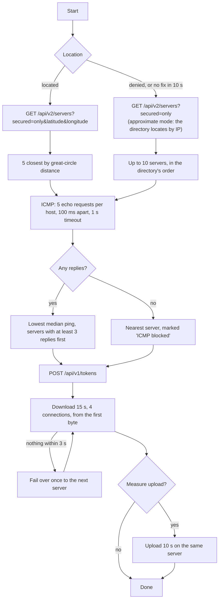

# Speed Test

A speed test for iPhone, iPad and Mac. It takes the five servers from Ubiquiti's public speed-test directory that are
closest to you, pings each of them with real ICMP, and measures the download speed on the one that answers fastest.
Upload is an optional extra.

  

| Finished, light | Finished, dark | History |
|---|---|---|
|  |  |  |

| Mac | iPad |
|---|---|
|  |  |

## What it does

1. On the first Start it asks for your location, then fetches the list of speed-test servers.
2. It takes the five closest servers and pings each of them over ICMP, five times.
3. It picks the server with the lowest median ping.
4. It downloads from that server for 15 seconds over parallel connections, showing the live speed and a live graph,
   and at the end the average. With "Measure upload too" switched on, it then uploads for 10 seconds the same way.

The screen shows the three values the task asks for (server, ping, download speed) as the first three rows of one
card, with Start/Stop pinned below. Around them: the elapsed time, a big live number, the graph, and the list of
pinged servers as their replies come in. Under the card a quiet line shows your public IP and provider, and a
History button opens the finished runs in a sheet.

The app is in English and Czech.

### How I found the API

The API isn't documented. I watched wifiman.com's network traffic in the browser's developer tools, then confirmed
every request with `curl`:

| Request | What it's for |
|---|---|
| `GET https://sp-dir.uwn.com/api/v2/servers?secured=only&latitude=…&longitude=…` | The server list with coordinates. `secured=only` makes every server URL `https://`. |
| `POST https://sp-dir.uwn.com/api/v1/tokens` | A test token, `{"token": "…", "ttl": 80}`. It goes in the `x-test-token` header. |
| `GET https://sp-dir.uwn.com/api/v1/ip` | Your public IP address and provider, shown under the result card. |
| `GET <server>/download?size=<bytes>` and `POST <server>/upload` | The transfers themselves. |

The web client measures latency with HTTP requests and a WebSocket. The app replaces both with real ICMP echo, as
the task asks, and doesn't use the other calls the web client makes (capability check, posting results).

## Running it

- **Xcode 26.6 or newer.** CI builds and tests with Xcode 26.6 and Xcode 27.0. The app needs iOS 17 or macOS 14.
- **Why Xcode 26.6:** I built this on an Intel Mac, after returning my M4 Max to my former employer. Xcode 27 runs
  only on Apple silicon, so 26.6 is the newest Xcode I could use locally. The `Xcode 27.0` CI job covers Swift 6.4
  and the iOS 27 SDK on every push.
- Open `SpeedTest.xcodeproj`, pick your own team under Signing & Capabilities, and run the `SpeedTest` scheme on an
  iPhone, an iPad, a simulator or "My Mac". The Swift packages resolve on the first build.
- **ICMP works on a device, in the Simulator and in the sandboxed Mac app.** Unprivileged ICMP sockets need no
  special entitlement, and the Simulator uses the Mac's network.
- **The Simulator doesn't use your Mac's location.** Set one in the Simulator's Features › Location menu, or the app
  picks servers near the simulated location (Cupertino by default).
- **A test uses real data:** 15 s at 300 Mbps is about 560 MB of download. Worth knowing on mobile data.
- **The package tests run through `xcodebuild`**, not `swift test`: SwiftPM on the command line doesn't compile
  String Catalogs. The commands are in `CLAUDE.md`.

## How it works

The `SpeedTest` reducer drives the run one step at a time: each step's effect does one piece of I/O through a
dependency client and sends the result back as an action, and the reducer decides what comes next. The only piece
of concurrency that lives in a dependency is the transfer meter, which holds the live connections, races the first
byte against the stall timeout, and turns the byte counter into a sample every 250 ms. `docs/DESIGN.md` has the full
design.

## Decisions and trade-offs

**ICMP, written for this app.** iOS has no public ping API. The app opens unprivileged `SOCK_DGRAM` sockets with
`IPPROTO_ICMP` / `IPPROTO_ICMPV6`, a standard system facility that needs no entitlement. The existing libraries were
either unmaintained or not ready for Swift 6 (SwiftyPing, GBPing, Apple's SimplePing sample from 2016), and the code
is small, against the socket API and RFC 792 / RFC 4443. The details that matter:
- IPv4 needs our own RFC 1071 checksum; the kernel fills in the ICMPv6 one.
- Each socket is `connect()`ed, so it only receives its own peer's replies, and every ping uses a random identifier
  and a random payload token. Five servers pinged at once can't mix up their replies.
- Replies are timestamped in the socket's read handler, not after a hop to another thread.

**NAT64.** Addresses come from `getaddrinfo` with `PF_UNSPEC` and `AI_DEFAULT`, which returns synthesized IPv6
addresses on IPv6-only mobile networks. ICMPv6 is handled throughout. My carrier is dual-stack, so this path is
tested on the loopback but not on a real IPv6-only network.

**The median of five, and replies before speed.** One slow reply shouldn't disqualify a server, so the ranking uses
the median. A server with at least 3 of 5 replies beats one with a lower median from only 1 or 2, because a server
that loses pings is a poor place to measure throughput.

**Approximate mode.** If location is denied, restricted or unavailable, the test still runs: the directory locates
the device by IP, the app pings up to 10 of the servers it returns, and latency decides. The screen says why, and
offers Settings when the user can change something.

**When no server answers ICMP.** Some servers drop ICMP (two of eight near Prague do). If none of the candidates
answers, the app uses the nearest one and says so. It never falls back to an HTTP "ping".

**One server, as the task asks.** The task asks for the download speed on the server with the lowest latency, so the
app measures one server. wifiman.com's web client spreads its connections over up to four servers at once and
can report a higher number on a fast line. One evening on my home line the web reported 234 Mbps, while single
servers gave 150–170 Mbps from the app and from `curl` alike; four servers in parallel from the app's own transfer
code gave 223 Mbps. The gap is the method, not the transfer code.

**A plain average.** The download result is total bytes divided by the time since the first byte. It includes TCP
slow start, which the graph shows as the ramp at the beginning. A plain average is what "average speed" means and is
easy to test.

**Parallel connections and memory.** One TCP connection rarely fills a fast line, so the app uses 4 parallel
connections (the web client uses 6; 8 measured no better on my line). Each connection asks for 50 MB and asks again as
soon as it finishes. Received data is counted and dropped at once: 15 s at 1 Gbps is about 1.9 GB that is never held
in memory. Upload sends one 8 MB random buffer over and over.

**A lock for the hot path.** At 1 Gbps the `URLSession` delegate gets thousands of callbacks a second. Those only add
to a counter behind an `OSAllocatedUnfairLock`. The transfer meter reads it every 250 ms and emits one sample, so the
reducer gets four actions a second and never sees an individual callback.

**Failover.** If every connection fails before the first byte (a lapsed certificate, a refused connection, a 401 or
429), or no data arrives within 3 s, the app switches once to the next server in the ranking, on another host when
there is one. After the first byte a dropped connection isn't retried, so a Wi-Fi drop can't quietly continue over
mobile data and produce a mixed result.

**HTTPS throughout.** With `secured=only` the directory returns `https://…wifiman.me` addresses with valid
certificates, on the same unusual ports. The app has no App Transport Security exception.

**Only Ubiquiti's servers.** The app sends a test token and up to 25 s of traffic to the server it picks, so it accepts
only `https` hosts under `wifiman.me` from the directory and drops anything else, even if the directory ever names
another host.

**As little of your location as needed.** The app asks for a fix accurate to about a kilometre and sends the directory
coordinates rounded to two decimals (about 1 km): enough to pick the closest servers, no more. History stays on the
device, in the app's own container, which the system encrypts at rest.

**What the app doesn't do.** It doesn't send results anywhere (the web client posts them to Ubiquiti), and it makes
one server-list request, one token request and one IP lookup per run, with no automatic retries. A 429 from the directory
shows "busy, try again in a minute".

**Honest counters.** Requests send `Accept-Encoding: identity`, so a compressing server can't inflate the number, and
the session has no cache. The upload counter measures bytes handed to the network stack.

**Download first, upload as an extra.** The task's test is the 15 s download, so that's what Start runs. Upload is a
switch below the card, off by default and remembered; with it on, a 10 s upload follows the download on the same
server and the whole run takes about 30 s.

**Beyond the brief, kept out of the way.** The main screen is the brief's screen. Everything else is an extra a
reader can ignore: upload is a switch, history is a sheet behind a toolbar button, the IP is one quiet line, and the
app runs on the Mac and in Czech too.

**One screen, laid out for the window.** On iPhone it's one column. On iPad and the Mac it's two panes: the
measurement and the button on the left, the upload switch and the servers on the right. The choice follows the size
class, not the device, so iPad Split View gets the column and an open iPhone Duo would get the panes. The Mac also has a
Test menu: Start/Stop on ⌘R, History on ⌘Y.

**Errors inline, not in alerts.** Failures appear in plain words where the result would be, with Try again.
Interruptions (Stop, the app going to the background on iOS, a network change, a lost connection) keep the partial
average and say what happened.

**Architecture.**
- A local Swift package with five modules. `ICMP` and `SpeedTestKit` have no UI and no TCA, so they work in any app;
  only `SpeedTestFeature` and `HistoryFeature` know about TCA.
- The reducer owns the flow and every decision; each dependency wraps one piece of I/O (locator, directory, pinger,
  transfer meter). Every reducer test runs against fakes and a test clock, with no network.
- History is a SQLite table through SQLiteData. The speed-test feature saves a finished run through a one-call
  `HistoryClient` dependency and never sees the database; the history sheet observes the table with `@FetchAll`.
  Stopped or interrupted runs aren't kept.
- Plain `throws` rather than typed throws: `URLSession`, clocks and cancellation throw untyped errors anyway. Every
  error is mapped to `SpeedTestError` in one place.
- Strings live in String Catalogs with stable keys and Xcode's generated symbols; numbers use `FormatStyle` in the
  user's locale.

## Testing

| Kind | What it covers |
|---|---|
| Unit tests | ICMP packets against captured bytes, the ping matching logic, the pinger against a fake socket and the real loopback (IPv4 and IPv6, two pingers at once), server selection, decoding the real directory JSON, the error mapping, the throughput sampler, and the transfer meter's sampling, stall race and interruptions against a test clock. |
| Reducer tests | The whole run step by step with TCA's exhaustive `TestStore`: Start to the chosen server, download and upload, failover, Stop at each phase, background, retry, the upload switch, the IP lookup, and which runs are saved. Plus the screen's text and the graph's data. |
| History tests | The list's order, deleting a row, Clear with its confirmation, against a temporary SQLite database. |
| UI test | One smoke test of the real app against a scripted run (no network, location or ICMP): a run fills the three fields and the address, and lands in the history. Only the wiring; what a run does is pinned in the tests above. |

CI (GitHub Actions) runs lint and then, on **Xcode 26.6** (iOS 26.5, macOS) and on **Xcode 27.0** (iOS 27.0,
macOS 27), the package tests on macOS and on the iOS simulator, both app builds and the UI test. The UI test's
screenshot of the finished run is kept with each run, so the Xcode 27 job shows how iOS 27 draws the screen. CI fails
on any compiler warning in this repository's sources.

Checked by hand on real hardware (an iPhone 14 Pro and an Intel Mac):
- ICMP on the iPhone over Wi-Fi and over mobile data
- ICMP from the sandboxed Mac app
- the location permission dialogs on both platforms
- the real throughput path, against `curl` and the web client

The recording and screenshots above are real runs on my home line: on the iPhone simulator 305 Mbps down with a 7 ms
ping to a server 1.4 km away, on the Mac 288 Mbps down and 271 Mbps up. Two things are not real: those builds answered
the IP lookup with a documentation address (203.0.113.7) instead of my own, and measured distances from central Prague
instead of my location.

## Known limitations

- The upload number counts bytes handed to the network stack, which is what every client can see.
- In approximate mode the servers are only as close as the directory's IP geolocation.
- "Closest" means closest by the coordinates the directory gives. A few entries carry wrong ones (two servers about
  130 km from Prague are listed a few kilometres away), so such a server can take the place of a closer one among the
  five. Ping still picks the fastest of them.
- NAT64 is untested on a real IPv6-only network (see above).

## Future work

- Snapshot tests of every screen state.
- Choosing a server by hand: tapping a row in the server list would run the test against it.

## License

MIT, see [LICENSE](LICENSE).

## How I built this

I designed the app and made the decisions; the reasoning is in `docs/DESIGN.md`. Claude Code (Anthropic's coding
agent) was my pair throughout: it helped investigate the undocumented API, drafted code and tests to the
conventions in `CLAUDE.md`, and reviewed changes. I reviewed every change, ran it on the devices, and approved every
commit.
